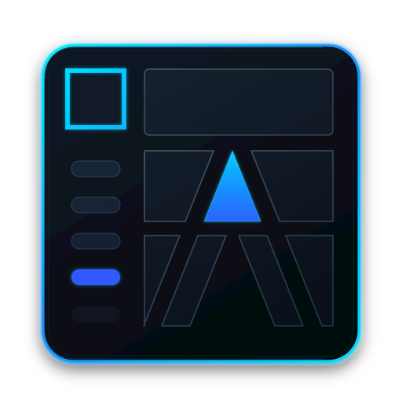
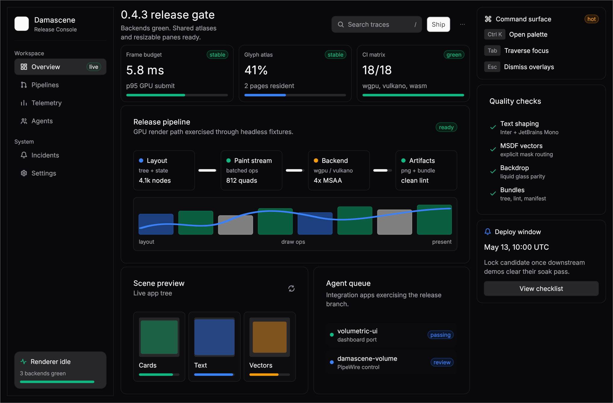
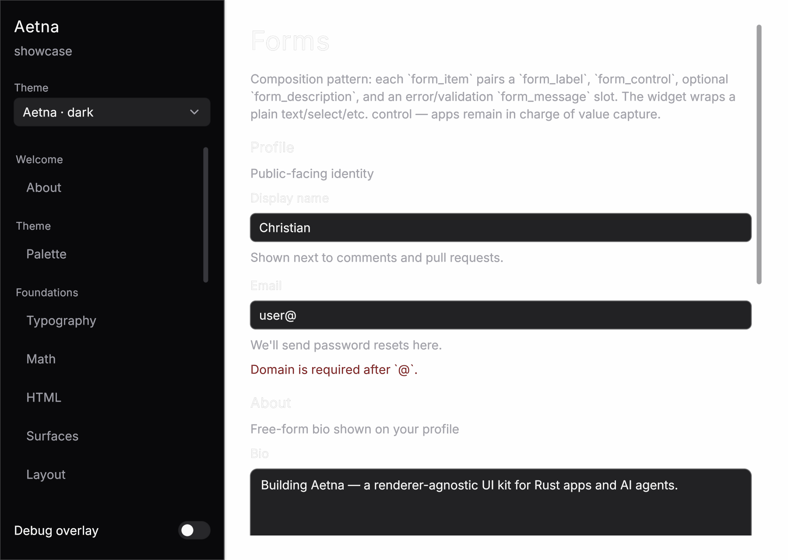
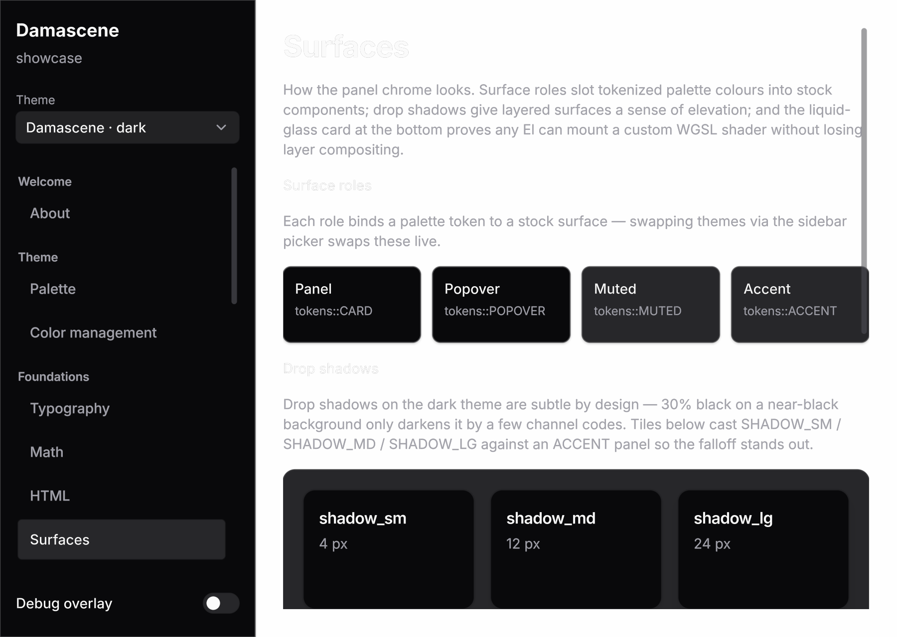
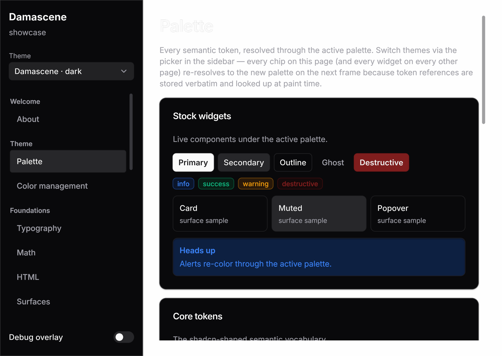

# Damascene



Damascene is a thin GPU UI rendering library that can insert into an existing Vulkan or wgpu renderer rather than owning the device, queue, or swapchain. The core/backends don't replace the host's renderer; they share its pass. For simple desktop apps, the workspace also ships an optional winit + wgpu host crate that packages the common window/surface loop. The name comes from **damascening**, the metalwork craft of inlaying precious metal into another surface to compose a finished image — fitting for a library that inlays its UI into the host's render pass rather than owning the swapchain.

Damascene is shaped around how **an LLM** authors UI, not how a human web developer does. The thesis: when the author is a model, the load-bearing constraints flip — vocabulary parity with the training distribution matters more than configurability, the *minimum* output should be the *correct* output, and the visual ceiling is set by what shaders the model can write, not by what the framework's CSS-shaped surface exposes.

Two architecture notes live under `docs/` — read these before reviewing. They are deliberately independent:

- **`docs/SHADER_VISION.md`** — the *rendering* layer. Current backend boundaries, paint-stream contract, shader/material model, backdrop-sampling contract, and host-integration split.
- **`docs/LIBRARY_VISION.md`** — the *application* layer. Current app/widget model, public surfaces an LLM author should see after crates.io packaging, crate layering, controlled-widget policy, and stability questions before serious app ports.

Current direction and longer-form design notes live under `docs/`.

## Hero demo

The lead image is a headless wgpu render of `damascene_fixtures::HeroDemo`, a backend-neutral app fixture composed from the same public `App` + widget surface that downstream apps use. It is intentionally a real operational UI rather than a widget catalog: sidebar, cards, badges, progress, command chrome, vector paths, and dense text all sharing one scene.

```bash
cargo run -p damascene-examples --bin hero        # interactive native demo
cargo run -p damascene-tools --bin render_hero   # regenerates assets/damascene_hero.png
```

The `Showcase` fixture remains the exhaustive coverage browser for every widget and system feature; the hero demo is the polished "best of Damascene" snapshot.

## Workspace shape

Damascene lives under `crates/`, with runnable cross-crate examples in the workspace `examples/` package:

| Crate | Role |
|---|---|
| `damascene-core` | Backend-agnostic core. Tree (`El`), layout, draw-op IR, stock shaders + custom-shader binding, animation primitives, hit-test, focus, hotkeys, lint + bundle artifacts. Plus the cross-backend paint primitives (`paint::QuadInstance` + paint-stream batching) and `runtime::RunnerCore` (the interaction half every backend `Runner` composes). No backend deps. |
| `damascene-fonts` + font asset crates | Published bundled font layer. `damascene-fonts` exposes feature flags for Inter, JetBrains Mono, emoji, symbols/math fallback, and Roboto; sibling crates hold the actual font bytes so each uploaded crate stays under crates.io's package-size cap. Each host crate (`damascene-web`, `damascene-winit-wgpu`, …) re-exports these as passthrough features defaulting to the full set, so a consumer can drop the ~9.5 MB color-emoji bundle with e.g. `damascene-web = { default-features = false, features = ["inter", "jetbrains-mono", "symbols"] }`. |
| `damascene-markdown` | Published markdown-to-`El` transformer over `pulldown-cmark`, with optional pure-Rust syntax highlighting and native math rendering (`MarkdownOptions::math(true)` lowers TeX/MathML-Core-shaped expressions through `damascene_core::math`'s box layout — no webview, no raster round-trip). The `Showcase` imports it through `damascene-fixtures`, but downstream apps can use it directly. |
| `damascene-html` | Published HTML-to-`El` transformer over `html5ever`. Used standalone or via `damascene-markdown`'s `html` feature to render inline/block HTML inside markdown. |
| `damascene-wgpu` | wgpu pipelines + per-page atlas textures + `Runner` shell. Wraps a shared `RunnerCore` from `damascene-core` for interaction state, paint-stream scratch, and the `pointer_*`/`key_down`/`set_hotkeys` surface; only GPU resources and the wgpu-flavoured `prepare()` GPU upload + `draw()` are backend-specific. |
| `damascene-fixtures` | Workspace-private backend-neutral showcase apps and render fixtures (`HeroDemo`, `Showcase`, icon gallery, text-quality matrix, liquid-glass lab). No windowing or GPU setup; examples, the web showcase, tools, and backend parity crates import the same fixtures for parity. Not a public dependency target. |
| `damascene-winit-wgpu` | Optional batteries-included native desktop host for simple winit + wgpu apps. Owns window/surface setup, MSAA target management, input mapping, IME forwarding, redraw-on-animation, plus opt-in host cadence / `before_build` hooks for live external state. Custom hosts can bypass it and call `damascene-wgpu::Runner` directly. |
| `damascene-examples` | Workspace examples package (`examples/`). User-facing interactive examples that intentionally pull multiple crates: `damascene-core` + `damascene-winit-wgpu`, plus `damascene-fixtures` or native helpers where needed. |
| `damascene-web` | Reusable wasm browser host. Downstream wasm crates call `start_with` / `start_with_config` from their own `#[wasm_bindgen(start)]` entry point to drive any `damascene_core::App` against a browser canvas, with `WebHandle::request_redraw` for external JS callbacks. |
| `damascene-vulkano` | Vulkan backend, peer to `damascene-wgpu`. WGSL → SPIR-V via `naga`; `Runner` mirrors `damascene_wgpu::Runner`'s public surface with `Arc<Device>`/`Queue`/`Format` constructor args. The interaction half + paint-stream loop route through the shared `RunnerCore` so behaviour cannot drift between backends. |
| `damascene-vulkano-demo` | winit + vulkano harness sibling of the wgpu demo path. Ships `bin/counter` (the boundary A/B fixture), `bin/custom` (the gradient WGSL fixture), and `bin/showcase` (driving the same `damascene-fixtures::Showcase` app through `damascene-vulkano`). |
| `damascene-ash` | Raw-`ash` Vulkan adapter, the third backend peer. For hosts that already own an ash renderer: the host keeps the instance, device, queues, command buffers, swapchain, and frame pacing; Damascene records into the host's pass through the same shared `RunnerCore`, so interaction behaviour cannot drift from the other backends. |
| `damascene-ash-demo` | Minimal raw-Vulkan harness for the ash adapter: `bin/hello` (smallest host integration) and `bin/showcase` (the shared `Showcase` fixture through `damascene-ash`). |

The architectural decision: `El` is the author's description of the scene; everything the library writes during a frame — computed rects, hover/press/focus state, envelope amounts, scroll offsets, animation tracker entries — lives in `UiState` side maps keyed by `El::computed_id`. The build closure produces a fresh `El` carrying zero library state; the runtime layer holds the state across rebuilds.

## Capabilities

| Capability | What it covers and how to see it |
|---|---|
| Grammar | `column`/`row`/`card`/`button`/`badge`/`text`/`spacer`, intrinsic + `Fill`/`Hug`/`Fixed` sizing, `pub const` tokens. |
| Theme palettes | shadcn-shaped color tokens with `Theme::damascene_dark()` / `Theme::damascene_light()` (the default; copies shadcn/ui zinc) plus three Radix Colors pairs: `Theme::radix_slate_blue_{dark,light}()`, `Theme::radix_sand_amber_{dark,light}()`, and `Theme::radix_mauve_violet_{dark,light}()` — eight stock palettes in total. `cargo run -p damascene-core --example palette_demo` renders every one. |
| Wgpu rendering | `cargo run -p damascene-examples --bin settings`; `cargo run -p damascene-wgpu --example render_png` writes `crates/damascene-wgpu/out/settings.wgpu.png` |
| HDR + color management | end-to-end color pipeline: `ColorPreferences` negotiation with the host, scRGB/HDR float swapchains, a working-color-space contract shared by all three backends, color-managed images, and per-image HDR remastering (`dynamic_range_limit` à la CSS — measured peak × live headroom, BT.2390 roll-off instead of clipping). `docs/COLOR_MANAGEMENT.md` is the architecture note. |
| Stock shaders | `rounded_rect` + `text_sdf` + `focus_ring` |
| Custom-shader escape hatch | `crates/damascene-wgpu/out/custom_shader.wgpu.png` — gradient buttons rendered by user-authored `shaders/gradient.wgsl` |
| Custom-layout escape hatch | `El::layout(f)` accepts a `LayoutFn(LayoutCtx) -> Vec<Rect>` that replaces the column/row/overlay distribution for a node's children. The library still recurses, still drives hit-test/focus/animation/scroll off the produced rects. `cargo run -p damascene-core --example circular_layout` → `crates/damascene-core/out/circular_layout.svg`; `cargo run -p damascene-examples --bin circular_layout` (interactive compass rose, click-routed through LayoutFn-produced rects) |
| Virtualized list | `virtual_list(count, row_height, build_row)` realizes only the rows whose rect intersects the viewport. Wheel events route via the existing scroll machinery; computed_ids derive from row keys so hover/press/focus state survives scrolling. `cargo run -p damascene-core --example virtual_list` (10k rows); `cargo run -p damascene-examples --bin virtual_list` (100k rows, interactive). Variable-height rows not yet supported. |
| App trait + hit-test + automatic hover/press | `cargo run -p damascene-examples --bin counter` (interactive); `crates/damascene-wgpu/out/counter.wgpu.png` |
| HiDPI text + shaped core layout + paragraph wrapping + text alignment | bundled Inter + JetBrains Mono by default (Roboto opt-in), `cosmic-text` core layout + swash rasterization, core-owned glyph atlas. SVG fallback (`crates/damascene-core/out/settings.svg`) aligned with wgpu output |
| Clip + modal/overlay | `cargo run -p damascene-core --example modal` → `crates/damascene-core/out/modal.svg` |
| Scroll viewport | `cargo run -p damascene-core --example scroll_list` → `crates/damascene-core/out/scroll_list.svg`; `cargo run -p damascene-examples --bin scroll_list` (interactive, wheel). `scroll([...]).pin_end()` opts in to the chat-log "stick to bottom" behaviour — offset follows new tail children, releases when the user scrolls up, re-engages on wheel-back-to-bottom. |
| Host-painted regions | reserve a keyed node in the tree, call `Runner::rect_of_key("viewport")` after `prepare()`, and let the host renderer paint into that rect |
| Focus traversal + keyboard routing | Tab / Shift+Tab / Enter / Space / Escape in any interactive demo |
| Hotkey system | `cargo run -p damascene-examples --bin hotkey_picker` — `j`/`k` movement, Ctrl+L, `/`, etc., zero per-key matching in the app |
| Animation primitives | spring + tween + per-(node, prop) tracker; library-owned hover / press / focus envelopes auto-ease on every keyed interactive node; author-facing `.animate(timing)` + `.opacity` / `.translate` / `.scale` for app-driven prop interpolation; `prepare()` returns `needs_redraw` so frames tick only while motion is in flight. `cargo run -p damascene-examples --bin animated_palette` |
| Rich text | attributed runs, per-glyph color / weight / italic / strikethrough, hard breaks, paragraph alignment shared between SVG fallback and GPU paths. `cargo run -p damascene-core --example inline_runs` → `crates/damascene-core/out/inline_runs.svg` |
| Inline text decorations | `.underline()`, `.strikethrough()`, `.link(url)` modifiers on text runs; runs sharing the same URL group together for hit-test. Renders identically through SVG fallback and the GPU path. |
| Static-text selection | `.selectable()` opt-in on any text leaf; pointer drag selects across multiple leaves and the painter draws a selection band behind the glyphs of every covered run. Double-click selects a word; triple-click selects a line / leaf; Esc clears. `Selection` is one app-owned value: the app returns it from `App::selection`, and `UiEventKind::SelectionChanged` lets `on_event` mirror the runtime's update back into app state. `text_input` / `text_area` participate in the same global model, so clicking in a paragraph dismisses input selection and vice versa. Linux primary-selection is wired through `arboard`'s `wayland-data-control`. `cargo run -p damascene-examples --bin text_selection` |
| Caret blink | `text_input` / `text_area` blink the caret while focused; runtime input paths bump caret activity so typing, clicking, and arrow movement keep the caret solid through interaction and reset the phase afterwards. |
| Pointer cursor model | `.cursor(Cursor::Pointer / Text / Grab / Grabbing / Move / NotAllowed / …)` on any El. Each frame `UiState` resolves the active cursor (press-target wins during drags, otherwise the hovered-ancestor walk picks the first explicit cursor); `damascene-winit-wgpu` forwards to `Window::set_cursor` and `damascene-web` forwards to `canvas.style.cursor`. Stock widgets are pre-annotated — buttons / switches / checkboxes get `Pointer`, text inputs and selectable text get `Text`, the slider toggles `Grab` ↔ `Grabbing` across the press. |
| Scrollbar polish | `scroll(...)` and `virtual_list(...)` paint a draggable thumb with hover-expand and click-to-page (clicking the track shifts the offset by ~one viewport in the click direction, with a small overlap to preserve context). Drag captures globally, matching native scrollbars. |
| Resize handle | `resize_handle(key, Axis::Row / Column)` is a sibling primitive between two panes; the app owns the size state and folds drag events through `resize_handle::apply_event_fixed` (one fixed pane + one filling pane) or `apply_event_weights` (two weighted panes), or builds its own handler on `delta_from_event`. 8px hit area, no Tab trap. Showcase `Section::Layout` exercises it. |
| Form scaffolding | `field_row("Label", control)` is the labelled-row primitive — left label, right control, vertical-center, full-width. Pure composition over `row` + `text.label()` + `spacer`; apps can fork the file and produce equivalents. `slider::apply_input` adds the small-amount/page-amount step semantics on top of `apply_event` for sliders driven by both pointer and keyboard. |
| Raster images | `image(Image::from_rgba8(width, height, pixels))` widget paints app-supplied RGBA pixels through a per-image GPU texture cache on both wgpu and vulkano. `ImageFit::Contain / Cover / Fill / None` projects natural pixel size into the resolved rect; `.image_tint(c)` recolors. `Section::Media` in the showcase is the parity fixture. |
| 3D scenes (`chart3d`) | backend-neutral `DrawOp::Scene3D` for small 3D graphs/models — instanced points, forward-lit meshes (including translucent materials), 3D lines, reference grid, colormaps, axis/tick labels and per-point labels with real depth occlusion, plus a keyed orbit/zoom/pan camera with spring-animated refocus. Renders identically on wgpu, vulkano, and ash; zero host glue. `cargo run -p damascene-examples --bin scene3d`; design note in `docs/SCENE3D_PLAN.md`. |
| Native math rendering | `damascene_core::math` lays out MathML-Core-shaped expression IR into TeX-style boxes (fractions, radicals, scripts, large operators, stretchy delimiters, tables/cases) rendered through the normal glyph pipeline — crisp at any DPI, themed like the surrounding text. Reachable from markdown via `MarkdownOptions::math(true)`; `docs/MATH_VISION.md` is the architecture note. |
| Toast notifications | apps accumulate `ToastSpec::success("…") / .warning(...) / .error(...) / .info(...)` and return them from `App::drain_toasts`; the runtime pushes them onto `UiState` and synthesizes a toast layer into the root after `build()` returns (same library-driven extension pattern as tooltips). TTL-driven auto-dismiss; explicit dismissals route as `{key}:dismiss` events. Requires an `Axis::Overlay` root so the synthesizer has somewhere to append. `Section::Status` exercises every level. |
| App-supplied SVG icons | `icon(SvgIcon::parse_current_color(include_str!("path.svg")))` paints any `currentColor` SVG through the same icon pipeline used for built-in `IconName`s; `icon_button(source)` wraps it with the standard interactive surface. Unknown string-typed icon names render an empty box rather than panicking. |
| Backdrop sampling | multi-pass render API + snapshot copy + `@group(1)` backdrop sampler made available to custom shaders; `liquid_glass.wgsl` is the architectural acceptance test. `cargo run -p damascene-tools --bin render_liquid_glass`; runs identically through wgpu native, vulkano native, and WebGPU |
| Widget kit + input plumbing | symmetry invariant — stock widgets compose only public surface (`capture_keys`, `paint_overflow`, `LayoutCtx::rect_of_key`, controlled state helpers, etc.). `crates/damascene-core/src/widget_kit.md` is the author contract; every stock widget under `crates/damascene-core/src/widgets/` is a pure composition. `PointerDown`, `SecondaryClick`, drag tracking, character / IME `TextInput` events, focused-node key capture, and `metrics::hit_text` are kit-public primitives. `UiState::widget_state` exists for advanced host/diagnostic experiments, not normal app widget code. |
| `text_input` / `text_area` | single + multi-line editing through app-owned `(value, Selection)` state, drag-to-select, shift-arrow extension, Esc to collapse selection, Ctrl+A/C/X/V through the host clipboard bridge (`text_input::clipboard_request` remains available for custom hosts), preferred-column Up/Down motion, line-wise Home/End, and PageUp/PageDown for text areas. Fixed-height text areas queue `caret_scroll_request_for` from `App::drain_scroll_requests` after accepted edit/navigation events so keyboard movement keeps the caret visible. Both widgets share the same controlled selection shape and public `apply_event` helpers. Built using only the public widget kit. `cargo run -p damascene-examples --bin text_input`; `cargo run -p damascene-examples --bin text_area` |
| Anchored popovers | two-pass layout positioning a popover relative to a trigger key (current-frame rect, no staleness); viewport-edge auto-flip; click-outside / Escape dismiss. `dropdown` and `context_menu` are compositions of `popover` + `popover_panel` + `menu_item` — no extra runtime wiring. Kit primitive: `LayoutCtx::rect_of_key` (any custom layout can position relative to keyed elements outside its own subtree). `cargo run -p damascene-examples --bin popover` — top dropdown, bottom dropdown (auto-flip-up), context menu, non-scrim tooltip |
| Tabs / segmented control | `tabs_list(key, &current, options)` + `tab_trigger` + `tabs::apply_event` mirror shadcn / Radix Tabs and the WAI-ARIA tablist pattern. Routed key `{key}:tab:{value}`. `cargo run -p damascene-examples --bin tabs` |
| Form primitives | `switch`, `checkbox`, `radio_group`/`radio_item`, and `progress` in `widgets/`. Switch and checkbox are controlled bools; `radio_group` parallels `tabs_list` with `{key}:radio:{value}`; `progress` is a non-interactive value bar. Animated state changes (thumb slide, check / dot fade-in). Demonstrated in `Section::Booleans` and `Section::Forms` of the `Showcase` fixture. |
| Drop shadows | `.shadow(s)` on any El renders a soft drop shadow under the rounded silhouette; `draw_ops` auto-widens the painted quad so shadowed widgets don't need to remember `paint_overflow`. Surface roles (Panel, Popover, Raised, Sunken) provide tasteful defaults via the theme. Handled identically in the SVG fallback. |
| Bundle pipeline | `tree.txt` + `draw_ops.txt` + `shader_manifest.txt` + `lint.txt` + `.svg` + `.png` per fixture. `crates/damascene-{core,wgpu}/out/*` (gitignored under `crates/*/out/`; regenerate by re-running the example, then `tools/svg_to_png.sh` for PNGs) |

Author guidance for app code — the "reach for these first" catalog, common
app-shell skeletons, the surface-roles primer, and the smells lookup —
ships with the published `damascene-core` crate. Read it on
[docs.rs/damascene-core](https://docs.rs/damascene-core) or under
[`crates/damascene-core/README.md`](crates/damascene-core/README.md).

## Gallery

The hero shot above is the app-shaped demo. Every image below is a headless render of `Showcase::with_section(...)` through `damascene-wgpu::Runner`, regenerated with `cargo run -p damascene-tools --bin render_showcase_sections`.

| Form primitives | Backdrop sampling | Animated palette |
|---|---|---|
|  |  |  |
| `switch` / `checkbox` / `radio_group` / `progress` over the `card` + `tabs_list` skeleton from the showcase fixture. | `liquid_glass.wgsl` consuming the `@group(1)` backdrop sampler — runs identically across wgpu, vulkano, and WebGPU. | `.animate(timing)` on `.scale` + `.translate` plus the eased press / hover envelopes the library writes for free. |

## Repository tour

```
docs/SHADER_VISION.md                 rendering-layer architecture
docs/LIBRARY_VISION.md                application/widget-layer architecture
docs/COLOR_MANAGEMENT.md              HDR / color-management architecture
docs/SCENE3D_PLAN.md                  Scene3D design + milestone log
docs/MATH_VISION.md                   native math rendering architecture
docs/HTML_VISION.md                   HTML transformer architecture
docs/MOBILE_VISION.md                 touch / small-viewport architecture
docs/POLISH_CALIBRATION.md            visual-quality calibration plan

crates/
  damascene-core/                    backend-agnostic core
    src/
      lib.rs                       prelude
      tree/                        El, Kind, Rect, Color (the scene description)
      layout.rs                    column/row/stack/scroll/overlay distribution; LayoutFn / VirtualItems

      ir.rs                        DrawOp::{Quad, GlyphRun, BackdropSnapshot}
      draw_ops.rs                  El + UiState → DrawOp[]; envelope-driven state visuals
      paint.rs                     cross-backend paint ABI: QuadInstance, paint-stream batching, scissor
      shader.rs                    ShaderHandle, UniformBlock, ShaderBinding

      state.rs                     UiState — side maps, trackers, hotkeys, animations, widget_state::<T>
      runtime.rs                   RunnerCore (shared interaction state + paint-stream loop) + TextRecorder
      event.rs                     App trait, UiEvent, UiEventKind, UiTarget, UiKey, KeyChord
      hit_test.rs                  pointer hit-test + scroll-target routing
      focus.rs                     linear focus traversal
      anim/                        AnimValue, Animation, SpringConfig, TweenConfig, per-node tick

      style.rs                     StyleProfile dispatch
      tokens.rs                    const tokens (colors, spacing, radii, type/icon sizes)

      widgets/                     stock vocabulary — see the catalog in the damascene-core crate README

      text/                        text shaping + atlas infrastructure
        atlas.rs                     unified RGBA glyph atlas (color emoji + outline glyphs)
        metrics.rs                   measure_text / wrap_lines / line_height / TextLayout

      bundle/                      artifact pipeline (the agent loop's feedback channel)
        artifact.rs                  bundle orchestration; render_bundle entry
        inspect.rs                   tree dump
        lint.rs                      provenance-tracked findings
        manifest.rs                  shader manifest + draw-op text
        svg.rs                       approximate SVG fallback

    shaders/
      rounded_rect.wgsl              the load-bearing stock shader
      gradient.wgsl                  custom-shader fixture
      liquid_glass.wgsl              backdrop-sampling acceptance test
    examples/                      headless artifact fixtures
    out/                           rendered artifacts per example

  damascene-wgpu/                    wgpu backend (Runner shell + pipelines + atlas mirror)
  damascene-vulkano/                 vulkano backend (Runner shell + pipelines + naga compile)
  damascene-ash/                     raw-ash Vulkan adapter for hosts that own the device
  damascene-ash-demo/                minimal raw-Vulkan harness + showcase for the ash adapter
  damascene-fixtures/                workspace-private Showcase + render fixtures
  damascene-winit-wgpu/              optional native winit + wgpu app host
  damascene-android/                 NativeActivity wrapper around the winit + wgpu host
  damascene-ios/                     UIKit/Xcode wrapper around the winit + wgpu host
  damascene-vulkano-demo/            vulkano demo harness + backend parity bins
  damascene-web/                     reusable wasm browser host
  damascene-web-showcase/            unpublished browser showcase bundle
  damascene-android-showcase/        unpublished Android NativeActivity showcase
  damascene-ios-showcase/            unpublished iOS staticlib showcase entry
  damascene-fonts/                   bundled Inter + JetBrains Mono + emoji/symbol faces (Roboto opt-in)
  damascene-fonts-*/                 split published font asset crates
  damascene-markdown/                markdown to El transformer (+ native math via core::math)
  damascene-html/                    HTML to El transformer
examples/                        interactive cross-crate examples (`damascene-examples`)
tools/                           Rust diagnostics (`damascene-tools`) plus helper scripts
```

## Try it locally

```bash
cargo run -p damascene-examples --bin hero                # polished release-console demo (wgpu)
cargo run -p damascene-examples --bin showcase            # the canonical interactive demo (wgpu)
cargo run -p damascene-examples --bin counter             # smallest interactive
cargo run -p damascene-examples --bin <name>              # text_input, text_area, popover, tabs, tooltip,
                                                      # scroll_list, virtual_list, hotkey_picker,
                                                      # animated_palette, slider_keyboard, settings_modal,
                                                      # circular_layout, custom_paint, ...
cargo run -p damascene-core --example <name>              # headless SVG / tree / draw_ops dump for any
                                                      # fixture under crates/damascene-core/examples/
cargo run -p damascene-tools --bin render_hero            # regenerate assets/damascene_hero.png
cargo run -p damascene-tools --bin dump_showcase_bundles  # CPU-only artifact dump for the full Showcase
cargo run -p damascene-tools --bin render_liquid_glass    # backdrop-sampling acceptance test
cargo run -p damascene-vulkano-demo --bin showcase        # same Showcase through the vulkano backend
cargo test --workspace --lib                          # ~1,360 unit tests
```

`tools/build_web.sh --serve` builds the wasm browser entry point and
serves it at `http://127.0.0.1:8083/` — same `Showcase` `App` impl, run
through the WebGPU canvas binding. Released versions are also published
to GitHub Pages by `.github/workflows/pages.yml`.

### Dev-profile overrides — copy this into your app's workspace

MSDF glyph generation is ~500× slower at `opt-level = 0`: the startup
ASCII warmup alone measures **~19 s in a debug build vs ~40 ms
optimized**, which reads as "damascene takes 20 seconds to start" (and
inside a Wayland dispatch callback it can starve the socket long enough
for the compositor to disconnect you). Cargo profile overrides apply
only at the **consuming workspace's root**, so damascene's own settings
cannot fix this for your app — add this block to *your* root
`Cargo.toml`:

```toml
# Optimize damascene's text rasterization/shaping stack in dev builds.
# Leaf dependencies that compile once; your own crates stay at
# opt-level 0 so incremental iteration speed is unaffected.
[profile.dev.package.fdsm]
opt-level = 3
[profile.dev.package.fdsm-ttf-parser]
opt-level = 3
[profile.dev.package.nalgebra]
opt-level = 3
[profile.dev.package.simba]
opt-level = 3
[profile.dev.package.image]
opt-level = 3
[profile.dev.package.ttf-parser]
opt-level = 3
[profile.dev.package.cosmic-text]
opt-level = 3
[profile.dev.package.swash]
opt-level = 3
[profile.dev.package.skrifa]
opt-level = 3
[profile.dev.package.zeno]
opt-level = 3
[profile.dev.package.fontdb]
opt-level = 3
```

This is the same set damascene's own workspace uses (see the comment in
the root `Cargo.toml`).

## Per-app artifact dumps

Damascene ships the bundle pipeline as the agent-loop feedback channel — but it's also the cheapest way to verify your *own* app's layout during development. A single CPU-only call produces five artifacts per scene:

- `*.svg` — visual fixture (approximate; layout-accurate; convert to PNG with `tools/svg_to_png.sh` when you want one).
- `*.tree.txt` — semantic walk of the laid-out tree with computed rects, source locations, roles.
- `*.draw_ops.txt` — the same draw-op IR a wgpu / vulkano `Runner` consumes.
- `*.lint.txt` — findings (raw colors instead of tokens, text overflowing nowrap boxes, duplicate IDs).
- `*.shader_manifest.txt` — every shader the tree uses, with resolved uniform values.

The core is in the prelude:

```rust
use damascene_core::prelude::*;

let theme = app.theme();
let cx = BuildCx::new(&theme);
let mut tree = app.build(&cx);
let bundle = render_bundle_themed(&mut tree, viewport, &theme);
write_bundle(&bundle, &out_dir, "scene_name")?;
if !bundle.lint.findings.is_empty() { eprint!("{}", bundle.lint.text()); }
```

Lint findings are gated on whether the offending element traces back to user code (vs. one of damascene's own widget closures); the bundle pass handles that automatically.

The per-app shape is small: a `MockBackend` returning a canned snapshot, a `Scene` enum enumerating the views worth dumping, and `app.on_event(UiEvent::synthetic_click(key), &EventCx::new())` to drive state through the same `on_event` path users hit. Output goes to `crates/<app>/out/` (gitignored). Reference implementations:

- `tools/src/bin/dump_showcase_bundles.rs` — damascene's own showcase, every section.
- [`damascene-volume::render_artifacts`](https://github.com/computer-whisperer/damascene-volume) — a real PipeWire control panel, one bundle per tab.
- [`rumble-damascene::dump_bundles`](https://github.com/u6bkep/rumble) — a chat client, one bundle per connection state.

The SVG pass exercises the same layout + draw-op pipeline the GPU does without spinning up a window, device, or backend. Layout regressions and lint findings appear as a diff in the tree dump — fast enough to run on every save.

## Reviewing this

Damascene's rendering thesis is well-defended (liquid glass running on three backends; the `RunnerCore` extraction means behavior literally cannot drift between backends). The widget-kit and text/popover surfaces have held the symmetry invariant — every stock widget under `crates/damascene-core/src/widgets/` composes only public surface, no `pub(crate)` reach-through, no `#[doc(hidden)]` items, no library-side `match` on the decorative `Kind` variants. `RunnerCore` is sealed from widget code. The `text_input` and `text_area` widgets are controlled widgets: apps own `(value, Selection)` state and call the public `apply_event` helpers from `on_event`. The contract is documented in `crates/damascene-core/src/widget_kit.md`.

The popover positioning model is genuinely two-pass. `LayoutCtx::rect_of_key` reads the *current-frame* rect (not the previous frame's), so a popover anchored to a trigger that was just laid out sees the up-to-date position. `anchor_rect`'s viewport-edge auto-flip and secondary-axis clamping have unit-test coverage for both-sides-overflow, exact-edge, and missing-key cases. `dropdown` and `context_menu` are pure compositions of `popover` + `popover_panel` + `menu_item` — no extra runtime wiring.

What remains is whether this shape is the right substrate for polished native apps, not just the Showcase fixtures. The first ports — including `damascene-volume`, a PipeWire control panel — are what test it, and their findings feed back into the design notes under `docs/`.

This is a young project. Concrete pushback — including "the symmetry invariant will fail at X, here's why" — is more valuable than incremental polish.
